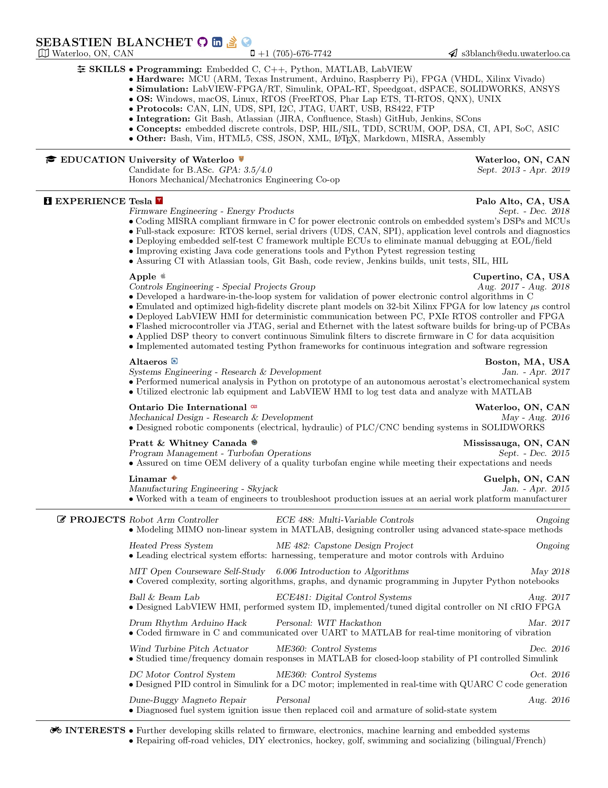

# LaTeX Resume

*Author: Sebastien Blanchet*

*Email: s3blanch@edu.uwaterloo.ca*

## Contents

* [Setup](#setup)
* [Preview](#preview)

## Setup

Instructions assume [MacTeX-2018 Distribution](http://tug.org/mactex/mactex-download.html) is installed on macOS

Clone this repository in a directory `dir` of choice:

```bash
cd dir
git clone https://github.com/sebastienblanchet/Resume.git
```

Change to the repository directory and compile the tex file with pdflatex:

```bash
cd Resume/res
pdflatex Resume.tex
```

Open the compiled pdf file:

```bash
open Resume.pdf
```

## Preview



Updated 12/8/2018